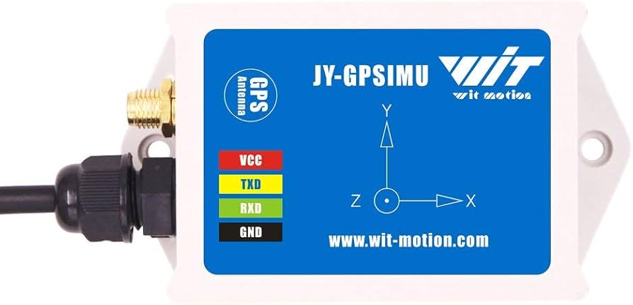

  

<!-- PROJECT LOGO -->
 

  <h3 align="center">WitMotion IMU Driver</h3>
  

	A driver for WitMotion IMU Driver
     
     
  

# A Driver for WitMotion IMU Sensors
A C++ software driver for WitMotion IMU sensor to acquiring the inertial and GPS data as well as commanding and calibrating the sensor.

  

## Plan

- Developing a software driver for acquiring the data.
- Developing the commanding and calibration components.
- Developing the Python wrapper for the library.
- Developing the ROS interface.
